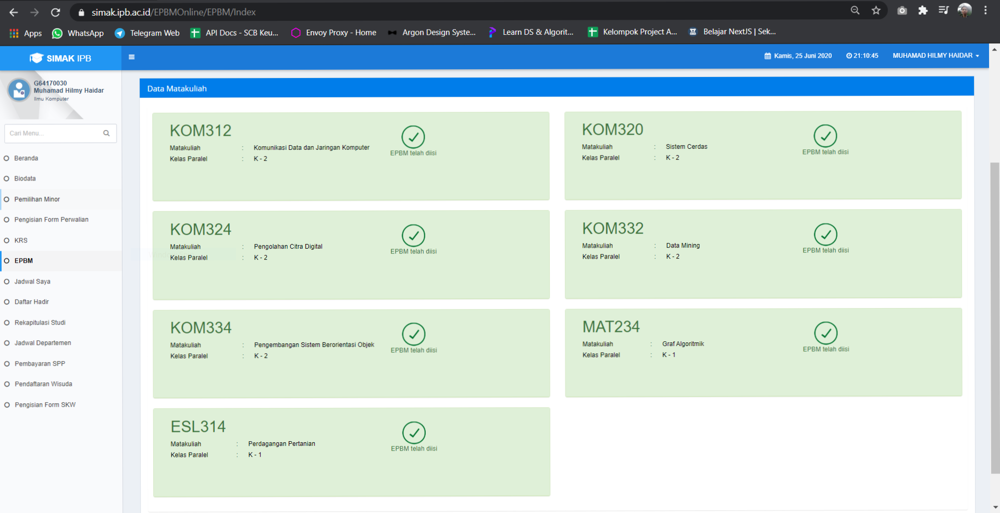

# SIMAK EPBM

Program ini dibuat agar memudahkan programer mengisi simak.

Terdiri dari 2 file penting yaitu :

- main.py
- model/robot.py

Package yang harus ada :

- python-dotenv
- requests
- BeutifulSoup

Versi python yang digunakan `python 3.6.8`

# CARA PEMAKAIAN

Ganti file `.env.backup` menjadi `.env` dan isi dengan username serta password akun IPB kalian :

```
USERNAME_IPB=blablabla
PASSWORD_IPB=blablabla
```

Buka terminal atau command line yang sudah terinstall python:

```python
python --version
Python 3.6.8 # atau diatasnya
```

Pindah ke folder project ini, lalu:

```python
python main.py
Beep boop ! robot untuk {username_kalian} siap
Mencoba melakukan GET ke alamat : https://simak.ipb.ac.id/Account/Login
Beep boop ! sekarang anda berada di https://simak.ipb.ac.id/Account/Login
Mencoba melakukan POST_LOGIN ke alamat : https://simak.ipb.ac.id/Account/Login
...

```

# PENTING

Saat program run dan mulai mengisi epbm, kalian harus menginput/mengetik 'y' untuk yes (mulai mengisi epbm tertentu)
atau 'n' untuk no (membatalkan mengisi epbm tertentu).

# TESTED


